Getting started with matrix kinship models in R using DemoKin
================
Diego Alburez-Gutierrez (Max Planck Institute for Demographic Research)
Workshop ‘The Formal Demography of Kinship: Theory and Application’ -
Dutch Demography Day; Nov 16 2022

  - [1. Installation](#1-installation)
  - [Built-in data](#built-in-data)
  - [2. The function `kin()`](#2-the-function-kin)
  - [3. Example: kin counts in time-invariant
    populations](#3-example-kin-counts-in-time-invariant-populations)
  - [4. Exercises](#4-exercises)

# 1\. Installation

Install the development version from GitHub. We made changes to the
`DemoKin` package ahead of this workshop If you had already installed
the package, please uninstall it and and install it again.

``` r
# remove.packages("DemoKin")
# install.packages("devtools")
devtools::install_github("IvanWilli/DemoKin", build_vignettes = TRUE)
```

Loas packages:

``` r
library(DemoKin)
library(dplyr)
```

    ## Warning: replacing previous import 'lifecycle::last_warnings' by
    ## 'rlang::last_warnings' when loading 'tibble'

    ## Warning: replacing previous import 'lifecycle::last_warnings' by
    ## 'rlang::last_warnings' when loading 'pillar'

    ## 
    ## Attaching package: 'dplyr'

    ## The following objects are masked from 'package:stats':
    ## 
    ##     filter, lag

    ## The following objects are masked from 'package:base':
    ## 
    ##     intersect, setdiff, setequal, union

``` r
library(knitr)
```

    ## Warning: package 'knitr' was built under R version 4.0.4

``` r
library(ggplot2)
```

    ## Warning: package 'ggplot2' was built under R version 4.0.4

``` r
library(fields)
```

    ## Warning: package 'fields' was built under R version 4.0.5

    ## Loading required package: spam

    ## Warning: package 'spam' was built under R version 4.0.5

    ## Loading required package: dotCall64

    ## Warning: package 'dotCall64' was built under R version 4.0.5

    ## Loading required package: grid

    ## Spam version 2.6-0 (2020-12-14) is loaded.
    ## Type 'help( Spam)' or 'demo( spam)' for a short introduction 
    ## and overview of this package.
    ## Help for individual functions is also obtained by adding the
    ## suffix '.spam' to the function name, e.g. 'help( chol.spam)'.

    ## 
    ## Attaching package: 'spam'

    ## The following objects are masked from 'package:base':
    ## 
    ##     backsolve, forwardsolve

    ## See https://github.com/NCAR/Fields for
    ##  an extensive vignette, other supplements and source code

# Built-in data

The `DemoKin` package includes data from Sweden as an example. The data
comes from the [Human Mortality Database](https://www.mortality.org/)
and [Human Fertility Database](https://www.humanfertility.org/). These
datasets were loaded using the`DemoKin::get_HMDHFD` function. To list
the data:

``` r
data(package="DemoKin")$results[ , 3:4] %>% 
  data.frame() %>% 
  kable()
```

| Item                      | Title                                                                                                                     |
| :------------------------ | :------------------------------------------------------------------------------------------------------------------------ |
| U\_caswell\_2021          | Historic and projected survival ratios from Sweden used in Caswell (2021)                                                 |
| f\_caswell\_2021          | Historic and projected fertility ratios from Sweden used in Caswell (2021)                                                |
| kin\_svk1990\_caswell2020 | Output for Slovakia 1990 in Caswell (2020).                                                                               |
| pi\_caswell\_2021         | Historic and projected mother´s age distribution of childbearing from Sweden used in Caswell (2021)                       |
| svk\_Hxs                  | Age where assign offspring of individuals in each partity stage (Caswell, 2021). All to zero age in this case.            |
| svk\_Uxs                  | Probability of transition among parity stage for Slovakia in 1990, for each age, conditional on survival (Caswell, 2021). |
| svk\_fxs                  | Female Slovakian fertility rates by parity stage in 1990 (Caswell, 2021)                                                  |
| svk\_pxs                  | Female Slovakian survival probabilities by parity stage in 1990 (Caswell, 2021)                                           |
| swe\_Sx                   | Female swedish survival ratios from 1900 to 2015                                                                          |
| swe\_asfr                 | Swedish age-specific fertility rates from 1900 to 2015                                                                    |
| swe\_pop                  | Female swedish population from 1900 to 2015                                                                               |
| swe\_px                   | Female swedish survival probabilities from 1900 to 2015                                                                   |
| swe\_surv                 |                                                                                                                           |

In this tutorial, we will use the data for Sweden.

### `swe_surv` matrix; survival ratio by age (DemoKin’s *U* argument)

This is what the data looks like:

``` r
swe_px[1:4, 1:4]
```

    ##      1900    1901    1902    1903
    ## 0 0.91060 0.90673 0.92298 0.91890
    ## 1 0.97225 0.97293 0.97528 0.97549
    ## 2 0.98525 0.98579 0.98630 0.98835
    ## 3 0.98998 0.98947 0.99079 0.99125

And plotted over time and age:

``` r
image.plot(
  x = as.numeric(colnames(swe_px))
  , y = 0:nrow(swe_px)
  , z = t(as.matrix(swe_px))
  , xlab = "Year"
  , ylab = "Survival ratio (U)"
  )
```

<!-- -->

### `swe_asfr` matrix; age specific fertility rate (DemoKin’s *f* argument)

This is what the data looks like:

``` r
swe_asfr[15:20, 1:4]
```

    ##       1900    1901    1902    1903
    ## 14 0.00013 0.00006 0.00008 0.00008
    ## 15 0.00053 0.00054 0.00057 0.00057
    ## 16 0.00275 0.00319 0.00322 0.00259
    ## 17 0.00932 0.00999 0.00965 0.00893
    ## 18 0.02328 0.02337 0.02347 0.02391
    ## 19 0.04409 0.04357 0.04742 0.04380

And plotted over time and age:

``` r
image.plot(
  x = as.numeric(colnames(swe_asfr))
  , y = 0:nrow(swe_asfr)
  , z = t(as.matrix(swe_asfr))
  , xlab = "Year"
  , ylab = "Age-specific fertility (f)"
  )
```

<!-- -->

# 2\. The function `kin()`

`DemoKin::kin()` currently does most of the heavy lifting in terms of
implementing matrix kinship models. This is what it looks like in
action, in this case assuming time-invariant demographic rates:

``` r
# First, get vectors for a given year
swe_surv_2015 <- DemoKin::swe_px[,"2015"]
swe_asfr_2015 <- DemoKin::swe_asfr[,"2015"]
# Run kinship models
swe_2015 <- kin(U = swe_surv_2015, f = swe_asfr_2015, time_invariant = TRUE)
```

## Arguments

  - **U** numeric. A vector (atomic) or matrix with probabilities (or
    survival ratios, or transition between age class in a more general
    perspective) with rows as ages (and columns as years in case of
    matrix, being the name of each col the year).
  - **f** numeric. Same as U but for fertility rates.
  - **time\_invariant** logical. Constant assumption for a given year
    rates. Default TRUE.
  - **output\_kin** character. kin types to return: “m” for mother, “d”
    for daughter, …

## Relative types

Relatives for the `output_kin` argument are identified by a unique code.
Note that the relationship codes used in `DemoKin` differ from those in
Caswell (2019). The equivalence between the two set of codes is given in
the following table:

``` r
demokin_codes()
```

    ##    DemoKin Caswell                      Label
    ## 1      coa       t    Cousins from older aunt
    ## 2      cya       v  Cousins from younger aunt
    ## 3        d       a                   Daughter
    ## 4       gd       b             Grand-daughter
    ## 5      ggd       c       Great-grand-daughter
    ## 6      ggm       h          Great-grandmother
    ## 7       gm       g                Grandmother
    ## 8        m       d                     Mother
    ## 9      nos       p   Nieces from older sister
    ## 10     nys       q Nieces from younger sister
    ## 11      oa       r     Aunt older than mother
    ## 12      ya       s   Aunt younger than mother
    ## 13      os       m               Older sister
    ## 14      ys       n             Younger sister

## Value

`DemoKin::kin()` returns a list containing two data frames: `kin_full`
and `kin_summary`.

``` r
str(swe_2015)
```

    ## List of 2
    ##  $ kin_full   : tibble[,7] [142,814 x 7] (S3: tbl_df/tbl/data.frame)
    ##   ..$ year     : logi [1:142814] NA NA NA NA NA NA ...
    ##   ..$ cohort   : logi [1:142814] NA NA NA NA NA NA ...
    ##   ..$ age_focal: int [1:142814] 0 1 2 3 4 5 6 7 8 9 ...
    ##   ..$ kin      : chr [1:142814] "d" "d" "d" "d" ...
    ##   ..$ age_kin  : int [1:142814] 0 0 0 0 0 0 0 0 0 0 ...
    ##   ..$ living   : num [1:142814] 0 0 0 0 0 0 0 0 0 0 ...
    ##   ..$ dead     : num [1:142814] 0 0 0 0 0 0 0 0 0 0 ...
    ##  $ kin_summary: tibble[,10] [1,414 x 10] (S3: tbl_df/tbl/data.frame)
    ##   ..$ age_focal     : int [1:1414] 0 0 0 0 0 0 0 0 0 0 ...
    ##   ..$ kin           : chr [1:1414] "coa" "cya" "d" "gd" ...
    ##   ..$ year          : logi [1:1414] NA NA NA NA NA NA ...
    ##   ..$ cohort        : logi [1:1414] NA NA NA NA NA NA ...
    ##   ..$ count_living  : num [1:1414] 0.2752 0.0898 0 0 0 ...
    ##   ..$ mean_age      : num [1:1414] 8.32 4.05 NaN NaN NaN ...
    ##   ..$ sd_age        : num [1:1414] 6.14 3.68 NaN NaN NaN ...
    ##   ..$ count_dead    : num [1:1414] 0 0 0 0 0 0 0 0 0 0 ...
    ##   ..$ count_cum_dead: num [1:1414] 0 0 0 0 0 0 0 0 0 0 ...
    ##   ..$ mean_age_lost : num [1:1414] NaN NaN NaN NaN NaN NaN NaN NaN NaN NaN ...

### `kin_full`

This data frame contains expected kin counts by year (or cohort), age of
Focal and age of kin.

``` r
head(swe_2015$kin_full)
```

    ## # A tibble: 6 x 7
    ##   year  cohort age_focal kin   age_kin living  dead
    ##   <lgl> <lgl>      <int> <chr>   <int>  <dbl> <dbl>
    ## 1 NA    NA             0 d           0      0     0
    ## 2 NA    NA             1 d           0      0     0
    ## 3 NA    NA             2 d           0      0     0
    ## 4 NA    NA             3 d           0      0     0
    ## 5 NA    NA             4 d           0      0     0
    ## 6 NA    NA             5 d           0      0     0

### `kin_summary`

This is a ‘summary’ data frame derived from `kin_full`. To produce it,
we sum over all ages of kin to produce a data frame of expected kin
counts by year or cohort and age of Focal (but *not* by age of kin).
This is how the `kin_summary` object is derived:

``` r
kin_by_age_focal <- 
  swe_2015$kin_full %>% 
  group_by(cohort, kin, age_focal) %>% 
  summarise(count = sum(living)) %>% 
  ungroup()
```

    ## `summarise()` has grouped output by 'cohort', 'kin'. You can override using the
    ## `.groups` argument.

``` r
# Check that they are identical (for living kin only here)

kin_by_age_focal %>% 
  select(cohort, kin, age_focal, count) %>% 
  identical(
    swe_2015$kin_summary %>% 
      select(cohort, kin, age_focal, count = count_living) %>% 
      arrange(cohort, kin, age_focal)
  )
```

    ## [1] TRUE

# 3\. Example: kin counts in time-invariant populations

Following Caswell (2019), we assume a female closed population in which
everyone experiences the Swedish 1950 mortality and fertility rates at
each age throughout their life. We then ask:

> How can we characterize the kinship network of an average member of
> the population (call her ‘Focal’)?

For this exercise, we’ll use the Swedish data pre-loaded with `DemoKin`.

``` r
library(DemoKin)
# First, get vectors for a given year
swe_surv_2015 <- DemoKin::swe_px[,"1950"]
swe_asfr_2015 <- DemoKin::swe_asfr[,"1950"]
# Run kinship models
swe_2015 <- kin(U = swe_surv_2015, f = swe_asfr_2015, time_invariant = TRUE)
```

## ‘Keyfitz’ kinship diagram

We can visualize the implied kin counts for a Focal woman aged 35 yo in
a time-invariant population using a network or ‘Keyfitz’ kinship diagram
(Keyfitz and Caswell 2005) using the `plot_diagram` function:

``` r
swe_2015$kin_summary %>% 
  filter(age_focal == 35) %>% 
  select(kin, count = count_living) %>% 
  plot_diagram(rounding = 2)
```

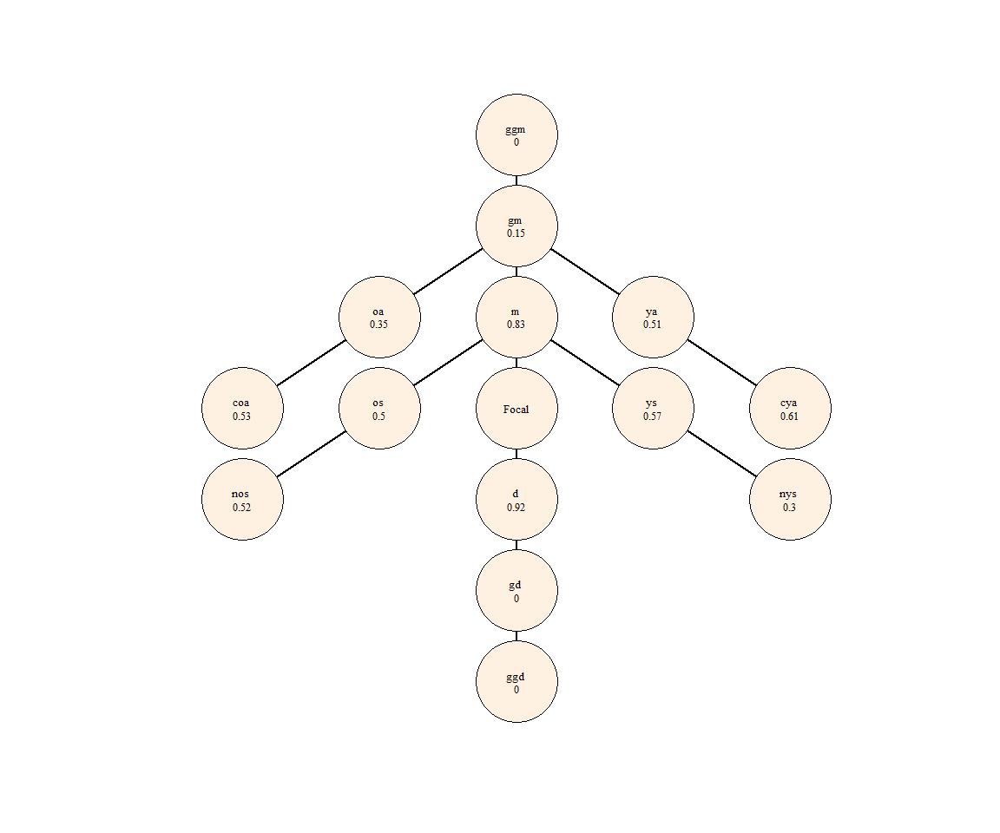<!-- -->

## Expected kin counts for a Focal person surviving to each age

Now, let’s visualize how the expected number of daughters, siblings,
cousins, etc., changes over the lifecourse of Focal (now, with full
names to identify each relative type using the function
`DemoKin::rename_kin()`).

``` r
swe_2015$kin_summary %>%
  rename_kin() %>% 
  ggplot() +
  geom_line(aes(age_focal, count_living))  +
  geom_vline(xintercept = 35, color=2)+
  theme_bw() +
  labs(x = "Focal's age") +
  facet_wrap(~kin)
```

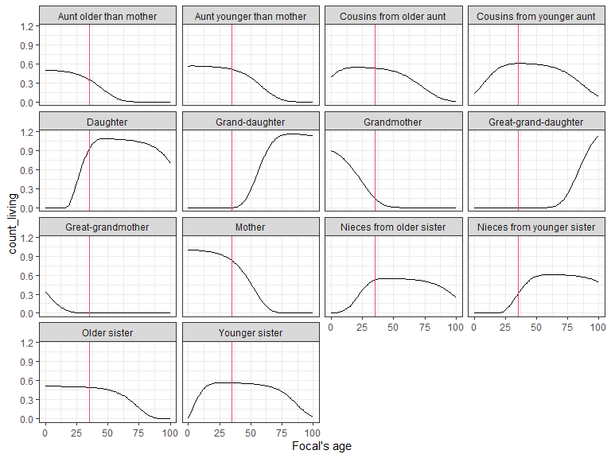<!-- -->

### Family size

How does overall family size (and family composition) vary over life for
an average woman who survives to each age?

``` r
counts <- 
  swe_2015$kin_summary %>%
  group_by(age_focal) %>% 
  summarise(count = sum(count_living)) %>% 
  ungroup()

counts %>% 
  ggplot() +
  geom_line(aes(age_focal, count), size = 1)  +
  coord_cartesian(ylim = c(0, 6)) +
  theme_bw() +
  labs(x = "Focal's age", y = "Number of living female relatives")
```

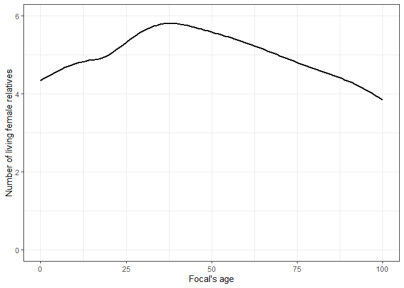<!-- -->

We can decompose this by relative type:

``` r
swe_2015$kin_summary %>%
  select(age_focal, kin, count_living) %>% 
  rename_kin(., consolidate_column = "count_living") %>%
  ggplot(aes(x = age_focal, y = count)) +
  geom_area(aes(fill = kin), colour = "black") +
  geom_line(data = counts, size = 2) +
  labs(x = "Focal's age", y = "Number of living female relatives") +
  coord_cartesian(ylim = c(0, 6)) +
  theme_bw() +
  theme(legend.position = "bottom")
```

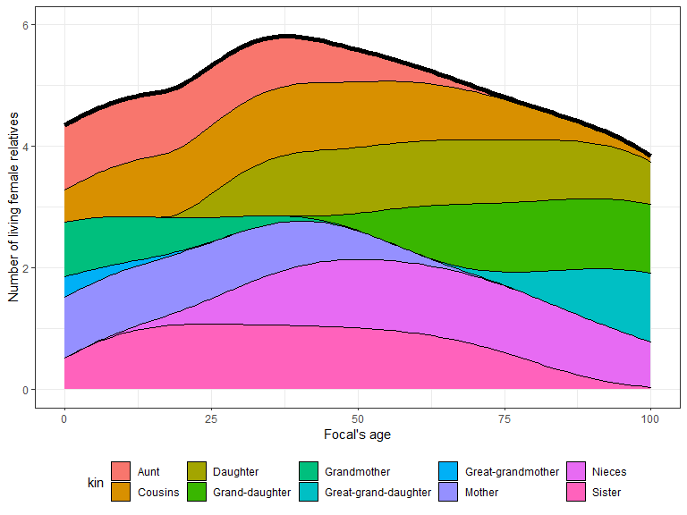<!-- -->

## Age distribution of relatives

How old are Focal’s relatives? Using the `kin_full` data frame, we can
visualize the age distribution of Focal’s relatives throughout Focal’s
life.

``` r
swe_2015$kin_full %>%
DemoKin::rename_kin() %>%
filter(age_focal == 35) %>%
ggplot() +
geom_line(aes(age_kin, living)) +
geom_vline(xintercept = 35, color=2) +
labs(y = "Expected number of living relatives") +
theme_bw() +
facet_wrap(~kin)
```

<!-- -->

We can also pick three points of Focal’s life: when she’s born (age=0)
at the end of her reproductive life (age=50) and when she retires
(age=65).

``` r
swe_2015$kin_full %>%
  filter(age_focal %in% c(0, 50, 65)) %>% 
  filter(kin %in% c("m", "d", "os", "ys")) %>%
  mutate(age_focal = as.character(age_focal)) %>% 
  rename_kin() %>% 
  ggplot() +
  geom_line(aes(x = age_kin, y = living, colour = age_focal), size = 1) +
  scale_color_discrete("Focal's age") +
  labs(x = "Age of Focal's kin", y = "Age distribution") +
  theme_bw() +
  facet_wrap(~kin)
```

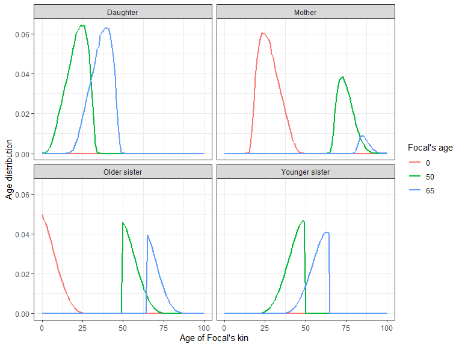<!-- -->

The output of the `DemoKin::kin()` function can also be used to easily
determine the mean age Focal’s relatives by kin type. For simplicity,
let’s focus on a Focal aged 35 yo and get the mean age (and standard
deviation) of her relatives in our time-invariant population.

``` r
ages_df <- 
  swe_2015$kin_summary %>% 
  filter(age_focal == 35) %>% 
  select(kin, mean_age, sd_age)

ma <- 
  ages_df %>% 
  filter(kin=="m") %>% 
  pull(mean_age) %>% 
  round(1)

sda <- 
  ages_df %>% 
  filter(kin=="m") %>% 
  pull(sd_age) %>% 
  round(1)

print(paste0("The mother of a 35-yo Focal woman in our time-invariant population is, on average, ", ma," years old, with a standard deviation of ", sda," years."))
```

    ## [1] "The mother of a 35-yo Focal woman in our time-invariant population is, on average, 61.8 years old, with a standard deviation of 5.9 years."

## Deceased kin

We have focused on living kin, but what about relatives who have died?
The output of `kin` also includes information of kin deaths experienced
by an average Focal.

We start by considering the number of kin deaths that an average can
expect to experience at each age. In other words, the non-cumulative
number of deaths in the family that Focal experiences at a given age.

``` r
loss1 <- 
  swe_2015$kin_summary %>%
  filter(age_focal>0) %>%
  group_by(age_focal) %>% 
  summarise(count = sum(count_dead)) %>% 
  ungroup()

loss1 %>% 
  ggplot() +
  geom_line(aes(age_focal, count), size = 1)  +
  labs(x = "Focal's age", y = "Number of kin deaths experienced (non-cumulative)") +
  coord_cartesian(ylim = c(0, 0.086)) +
  theme_bw()
```

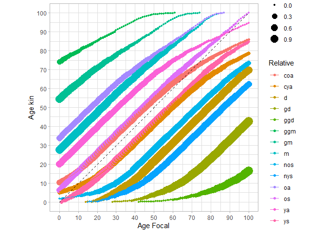<!-- -->

How are these deaths distributed by type of relative? We can decompose
this by kin type:

``` r
swe_2015$kin_summary %>%
  filter(age_focal>0) %>%
  group_by(age_focal, kin) %>% 
  summarise(count = sum(count_dead)) %>% 
  ungroup() %>% 
  rename_kin(., consolidate_column = "count") %>% 
  ggplot(aes(x = age_focal, y = count)) +
  geom_area(aes(fill = kin), colour = "black") +
  geom_line(data = loss1, size = 2) +
  labs(x = "Focal's age", y = "Number of kin deaths experienced at each age") +
  coord_cartesian(ylim = c(0, 0.086)) +
  theme_bw() +
  theme(legend.position = "bottom")
```

    ## `summarise()` has grouped output by 'age_focal'. You can override using the
    ## `.groups` argument.

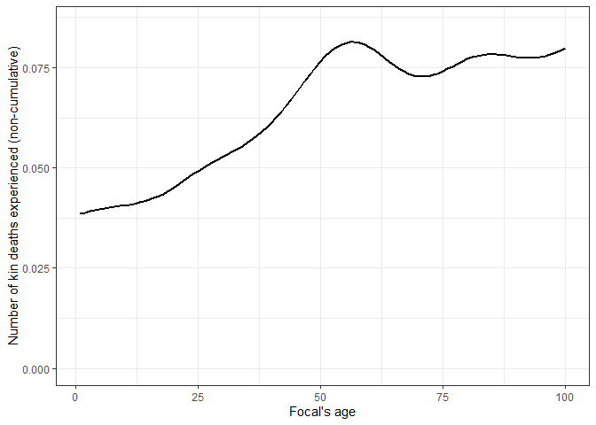<!-- -->

### Cumulative number of kin deaths

Now, we combine all kin types to show the cumulative burden of kin death
for an average member of the population surviving to each age:

``` r
loss2 <- 
  swe_2015$kin_summary %>%
  group_by(age_focal) %>% 
  summarise(count = sum(count_cum_dead)) %>% 
  ungroup()

loss2 %>% 
  ggplot() +
  geom_line(aes(age_focal, count), size = 1)  +
  labs(x = "Focal's age", y = "Number of kin deaths experienced") +
  theme_bw()
```

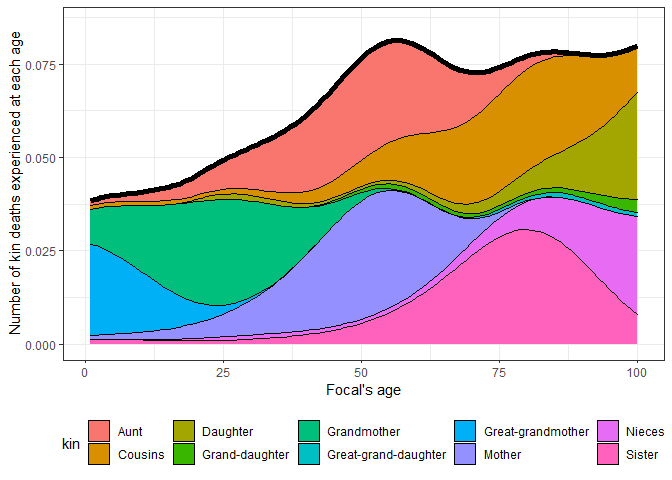<!-- -->

A member of the population aged 15, 50, and 65yo will have experienced,
on average, the death of 0.6, 2.6, 3.8 relatives, respectively. We can
decompose this by relative type:

``` r
swe_2015$kin_summary %>%
  group_by(age_focal, kin) %>% 
  summarise(count = sum(count_cum_dead)) %>% 
  ungroup() %>% 
  rename_kin(., consolidate = "count") %>% 
  ggplot(aes(x = age_focal, y = count)) +
  geom_area(aes(fill = kin), colour = "black") +
  geom_line(data = loss2, size = 2) +
  labs(x = "Focal's age", y = "Number of kin deaths experienced (cumulative)") +
  theme_bw() +
  theme(legend.position = "bottom")
```

    ## `summarise()` has grouped output by 'age_focal'. You can override using the
    ## `.groups` argument.

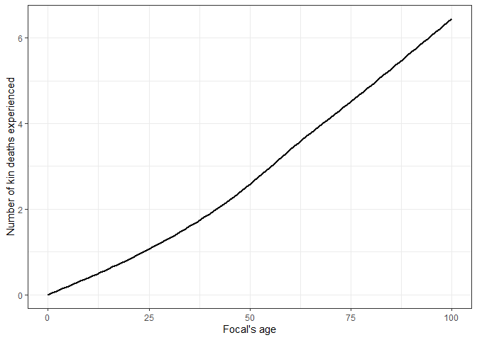<!-- -->

# 4\. Exercises

## Exercise 1. Age of kin

How old are, on average, Focal’s sisters over the lifecourse of Focal?

**Instructions**

Plot the mean and SD of the age of Focal’s sisters over the ages of
Focal. Plot separately (1) for younger and older sisters, (2) and for
all sisters.

**Solution**

First, get mean and SD of ages of sisters distinguishing between younger
and older sisters:

``` r
library(tidyr)

# First, get vectors for a given year
swe_surv_x <- DemoKin::swe_px[,"2010"]
swe_asfr_x <- DemoKin::swe_asfr[,"2010"]
# Run kinship models
swe_x <- kin(U = swe_surv_x, f = swe_asfr_x, time_invariant = TRUE, output_kin = "m")

# For plotting
dummy <- data.frame(
      age_focal = 0:100
      , name = "mean"
      , value = 0:100
      , kin = "os"
      )

# Younger and older sister separately
swe_x$kin_full %>% 
  rename_kin() %>% 
  group_by(age_focal, kin) %>% 
  summarise(
    mean = sum(0:100*living)/sum(living)
    , sd = sqrt(sum(living * (0:100 - mean)^2) / sum(living))
  ) %>% 
  ungroup() %>% 
  pivot_longer(cols = mean:sd) %>% 
  ggplot(aes(x = age_focal, y = value, colour = kin)) +
  geom_line() +
  geom_line(data = dummy, colour = "black", linetype = "dashed") +
  # geom_abline(slope = 1, linetype = "dashed") +
  facet_wrap(~name, scales = "free") +
  labs(y = "Age of sister") +
  theme_bw()
```

    ## `summarise()` has grouped output by 'age_focal'. You can override using the
    ## `.groups` argument.

    ## Warning: Removed 12 row(s) containing missing values (geom_path).

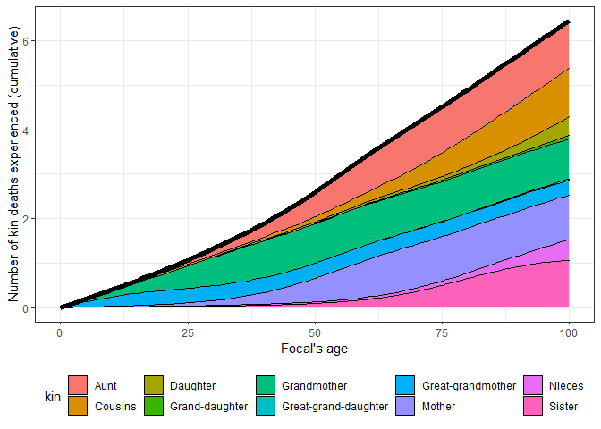<!-- -->

Second, get ages of all sisters, irrespective of whether they are older
or younger:

``` r
# All sister together
swe_x$kin_full %>% 
  group_by(age_focal) %>% 
  summarise(
    mean = sum(0:100*living)/sum(living)
    , sd = sqrt(sum(living * (0:100 - mean)^2) / sum(living))
  ) %>% 
  ungroup() %>% 
  pivot_longer(cols = mean:sd) %>% 
  ggplot(aes(x = age_focal, y = value)) +
  geom_line() +
    geom_line(data = dummy, colour = "red", linetype = "dashed") +
  facet_wrap(~name, scales = "free") +
  labs(y = "Age of sister") +
  theme_bw()
```

    ## Warning: Removed 12 row(s) containing missing values (geom_path).

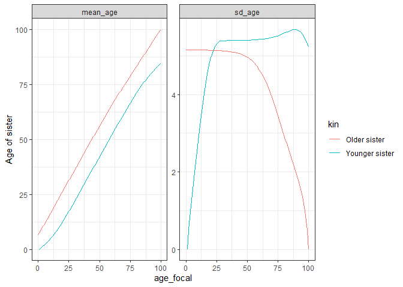<!-- -->

For all exercises, assume time-invariant rates at the 2010 levels in
Sweden and a female-only population. All exercises can be completed
using datasets included in DemoKin.

## Exercise 2. Living mother

What is the probability that Focal (an average Swedish woman) has a
living mother over Focal’s live?

**Instructions**

Use DemoKin to obtain \(M_1(a)\), the probability of having a living
mother at age \(a\) in a stable population. Conditional on ego’s
survival, \(M_1{(a)}\) can be thought of as a survival probability in a
life table: it has to be equal to one when \(a\) is equal to zero (the
mother is alive when she gives birth), and goes monotonically to zero.

**Answer:** What is the probability that Focal has a living mother when
Focal turns 70 years old?

**Solution:**

``` r
# First, get vectors for a given year
swe_surv_x <- DemoKin::swe_px[,"2010"]
swe_asfr_x <- DemoKin::swe_asfr[,"2010"]
# Run kinship models
swe_x <- kin(U = swe_surv_x, f = swe_asfr_x, time_invariant = TRUE, output_kin = "m")

swe_x$kin_summary %>% 
  ggplot(aes(x = age_focal, y = count_living)) +
  geom_line() +
  labs(x = "Focal's age", y = "M1(a)") +
  theme_bw()
```

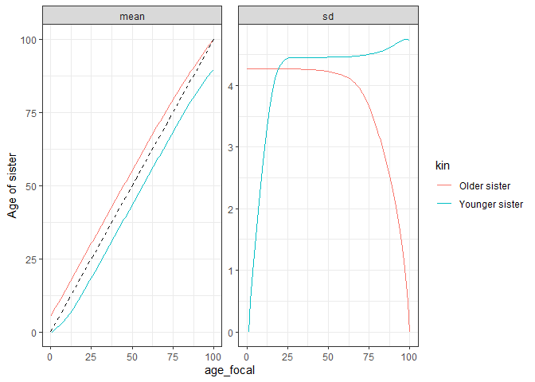<!-- -->

``` r
swe_x$kin_summary$count_living[71]
```

    ## [1] 0.0538275

## Exercise 3. Sandwich Generation

The ‘Sandwich Generation’ refers to persons who are squeezed between
frail older parents and young dependent children and are assumed to have
simultaneous care responsibilities for multiple generations, potentially
limiting their ability to provide care. In demography, ‘sandwichness’ is
a generational process that depends on the genealogical position of an
individual vis-a-vis their ascendants and descendants. For this
exercise, we consider an individual to be ‘sandwiched’ if they have at
least one child aged \(15\) or younger and a parent or parent within
\(5\) years of death. Alburez‐Gutierrez, Mason, and Zagheni(2021)
defined the probability that an average woman aged \(a\) is ‘sandwiched’
in a stable female population as:

where

  - \(m_{a-x}\) is the fertility of women at age \(a-x\), and
  - \(M_1(a)\) is the probability of having a living mother at age \(a\)
    in a stable population.

These estimates refer to an average woman in a female population,
ignoring the role of offspring mortality.

**Instructions**

Use DemoKin to compute the probability that Focal is sandwiched,
\(S(a)\), between ages 15 and 75. Assume time-invariant rates at the
2010 levels and a female-only population.

**Answer:** At which age is Focal at a highest risk of finding herself
sandwiched between young dependent children and fragile older parents?

**Solution:**

``` r
# First, get vectors for a given year
swe_surv_x <- DemoKin::swe_px[,"2010"]
swe_asfr_x <- DemoKin::swe_asfr[,"2010"]
# Run kinship models
swe_x <- kin(U = swe_surv_x, f = swe_asfr_x, time_invariant = TRUE, output_kin = "m")

M1 <- swe_x$kin_summary$count_living

# Implement equation: 

ages <- 15:75
  
S <- numeric(0)

for (a in ages){
  a_minus_x <- a - 1:15
  a_minus_x <- a_minus_x[a_minus_x > 0]

  fert_risk <- 1 - prod(1 - swe_asfr_x[a_minus_x])

  M1a <- M1[a]

  mom_dies <- 1 - M1[a + 5]/M1[a]

  Sa <- fert_risk * M1a * mom_dies
  S <- c(S, Sa)
}

max_S <- ages[max(S) == S]

data.frame(age_focal = ages, y = S) %>% 
  ggplot(aes(x = age_focal, y = S)) +
  geom_line() +
  geom_vline(xintercept = max_S, colour = "red") +
  labs(x = "Focal's age", y = "Probability of Sandwich S(a)") +
  theme_bw()
```

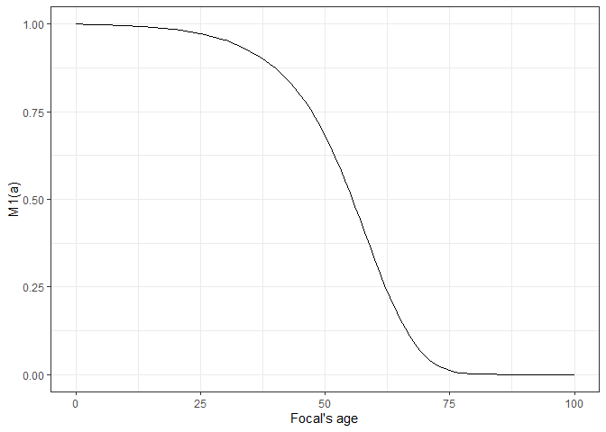<!-- -->

## References

<div id="refs" class="references">

<div id="ref-alburezgutierrez_sandwich_2021">

Alburez‐Gutierrez, Diego, Carl Mason, and Emilio Zagheni. 2021. “The
‘Sandwich Generation’ Revisited: Global Demographic Drivers of Care
Time Demands.” *Population and Development Review* Advanced publication
(September). <https://doi.org/10.1111/padr.12436>.

</div>

<div id="ref-caswell_formal_2019">

Caswell, Hal. 2019. “The Formal Demography of Kinship: A Matrix
Formulation.” *Demographic Research* 41 (September): 679–712.
<https://doi.org/10.4054/DemRes.2019.41.24>.

</div>

<div id="ref-Keyfitz2005">

Keyfitz, Nathan, and Hal Caswell. 2005. *Applied Mathematical
Demography*. New York: Springer.

</div>

</div>
